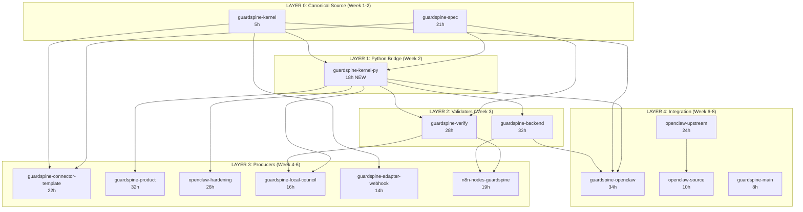

# GuardSpine Ecosystem: Linus Torvalds B+ Standard Remediation Plan

**Generated:** 2026-02-03
**Source:** GuardSpine-Audit-Latest-2026-02-03 (15 audit documents)
**Target:** Achieve B+ quality standard (8.0/10) across all repositories
**Current Score:** 5.2/10 average

---

## Executive Summary

The GuardSpine ecosystem has **72 identified issues** across 15 repositories, with a critical architectural flaw: **8 repositories have independently reimplemented canonicalization/hashing logic**, creating an "8-headed hydra" that guarantees drift and interop failures.

| Severity    | Count | Impact                                  |
| ----------- | ----- | --------------------------------------- |
| P0 Critical | 12    | Breaking bugs, security vulnerabilities |
| P1 High     | 35    | Interop drift, reliability risks        |
| P2 Medium   | 25    | Quality gaps, documentation drift       |

**The #1 fix**: Create a single canonical Python bridge (`guardspine-kernel-py`) and delete all local reimplementations.

---

## The 8-Headed Canonicalization Hydra

Each of these repos has its own hashing/sealing implementation, violating the "single source of truth" principle:

| Repo                          | Language    | File                            | Status        |
| ----------------------------- | ----------- | ------------------------------- | ------------- |
| @guardspine/kernel            | TypeScript  | src/seal.ts                     | **CANONICAL** |
| guardspine-backend            | Python      | app/core/kernel.py              | DUPLICATE     |
| guardspine-verify             | Python      | verifier.py                     | DUPLICATE     |
| openclaw-hardening            | Python      | hash_chain/chain.py             | DUPLICATE     |
| guardspine-local-council      | Python      | council.py                      | DUPLICATE     |
| guardspine-openclaw           | JS + Python | plugin.js, rlm_docsync.py       | DUPLICATE x2  |
| guardspine-product            | Python      | common/evidence.py              | DUPLICATE     |
| guardspine-connector-template | Python + TS | bundle_emitter.py, connector.ts | DUPLICATE x2  |
| guardspine-adapter-webhook    | TypeScript  | bundle-emitter.ts               | DUPLICATE     |

**Solution**: All Python repos must use `guardspine-kernel-py` (to be created). All JS/TS repos must import `@guardspine/kernel` directly.

---

## Repository Scorecards (Worst to Best)

| Rank | Repository                    | Score  | P0  | P1  | P2  | Priority |
| ---- | ----------------------------- | ------ | --- | --- | --- | -------- |
| 1    | guardspine-connector-template | 1.6/10 | 4   | 4   | 3   | CRITICAL |
| 2    | guardspine-product            | 2.8/10 | 4   | 3   | 3   | CRITICAL |
| 3    | guardspine-openclaw           | 3.0/10 | 2   | 3   | 2   | CRITICAL |
| 4    | n8n-nodes-guardspine          | 5.2/10 | 1   | 3   | 2   | HIGH     |
| 5    | guardspine-verify             | 5.2/10 | 1   | 4   | 4   | HIGH     |
| 6    | guardspine-local-council      | 5.2/10 | 0   | 4   | 2   | MEDIUM   |
| 7    | openclaw-source               | 5.0/10 | 0   | 3   | 2   | MEDIUM   |
| 8    | openclaw-upstream             | 5.4/10 | 0   | 3   | 3   | MEDIUM   |
| 9    | guardspine-spec               | 5.6/10 | 0   | 3   | 2   | MEDIUM   |
| 10   | guardspine-backend            | 5.6/10 | 0   | 5   | 3   | MEDIUM   |
| 11   | openclaw-hardening            | 5.6/10 | 0   | 5   | 3   | MEDIUM   |
| 12   | guardspine-adapter-webhook    | 5.8/10 | 0   | 3   | 3   | LOW      |
| 13   | guardspine-kernel             | 6.6/10 | 0   | 1   | 2   | LOW      |
| 14   | guardspine-main               | 8.0/10 | 0   | 1   | 0   | DONE     |
| 15   | openclaw-local-config         | 10/10  | 0   | 0   | 0   | DONE     |

---

## Security Issues (Fix Immediately)

### SEC-001: L4 Self-Approval Bypass [CRITICAL]

- **Repo**: guardspine-openclaw
- **File**: `plugin.js:683-699`
- **Issue**: `guardspine_approve` tool allows any agent to approve its own L4 actions without authentication
- **Impact**: Bypasses human approval intent entirely
- **Fix**: Add out-of-band authentication token check OR remove tool and require external approval channel

### SEC-002: ZIP Bomb Vulnerability [HIGH]

- **Repo**: guardspine-verify
- **File**: `verifier.py`
- **Issue**: ZIP ingestion has no safety limits (max size, entry count, path traversal)
- **Impact**: Memory/CPU exhaustion on untrusted artifacts
- **Fix**: Add max compressed size (100MB), max uncompressed size (1GB), max entry count (10000), path traversal rejection

### SEC-003: Unknown Tools Default to L2/Allowed [HIGH]

- **Repo**: guardspine-openclaw
- **File**: `plugin.js:86-99`
- **Issue**: `classifyRisk` returns L2 (allowed with evidence) for any unknown tool
- **Impact**: New tools bypass L3/L4 safeguards
- **Fix**: Change default to L3 (requires council review) for unknown tools

### SEC-004: Unsigned Bundles Verify with Public Key [MEDIUM]

- **Repo**: guardspine-verify
- **File**: `verifier.py`
- **Issue**: When `public_key_pem` is provided, unsigned bundles still return `verified=True`
- **Impact**: Callers may misinterpret as cryptographic success
- **Fix**: Add `require_signatures=True` flag; when key provided + no signatures = verification failure

---

## Phase 1: Stop the Bleeding (Week 1)

### 1.1 Fix Security Issues

| Task                              | Repo                | Effort |
| --------------------------------- | ------------------- | ------ |
| Add auth gate to L4 approval      | guardspine-openclaw | 2h     |
| Add ZIP safety limits             | guardspine-verify   | 4h     |
| Change unknown tool default to L3 | guardspine-openclaw | 1h     |
| Add require_signatures flag       | guardspine-verify   | 2h     |

### 1.2 Fix P0 Breaking Bugs

| Task                                      | Repo                 | Effort |
| ----------------------------------------- | -------------------- | ------ |
| Change `artifact_kind` to `artifact_type` | n8n-nodes-guardspine | 1h     |
| Fix hash chain binding to items list      | guardspine-verify    | 4h     |

### 1.3 Emergency Fixes for guardspine-connector-template

| Task                                         | File              | Effort |
| -------------------------------------------- | ----------------- | ------ |
| Add missing CLI entrypoint                   | connector/cli.py  | 2h     |
| Fix API endpoint to `/api/v1/bundles/import` | bundle_emitter.py | 1h     |

**Week 1 Total: 17 hours**

---

## Phase 2: Establish Single Canon (Weeks 2-3)

### 2.1 Create guardspine-kernel-py Package (NEW)

```
guardspine-kernel-py/
  src/guardspine_kernel_py/
    __init__.py
    bridge.py          # Calls @guardspine/kernel via subprocess
    types.py           # Python types matching kernel
    seal.py            # seal_bundle() wrapper
    verify.py          # verify_bundle() wrapper
  tests/
    test_parity.py     # Golden vector tests
  pyproject.toml
```

**Key Functions**:

```python
def seal_bundle(items: list[EvidenceItem], proof_version: str = "0.2.0") -> SealedBundle:
    """Calls @guardspine/kernel sealBundle via Node subprocess"""

def verify_bundle(bundle: dict, public_key_pem: str | None = None) -> VerificationResult:
    """Calls @guardspine/kernel verifyBundle via Node subprocess"""

def canonical_json(obj: dict) -> str:
    """Calls @guardspine/kernel canonicalJSON"""
```

**Effort**: 16 hours

### 2.2 Create Golden Vector Test Suite

Add to `guardspine-spec/fixtures/`:

```
fixtures/
  golden-vectors/
    v0.2.0-minimal-bundle.json
    v0.2.0-signed-bundle.json
    v0.2.0-multi-item-bundle.json
    expected-hashes.json
    expected-chain.json
```

**Effort**: 8 hours

### 2.3 Add Parity Tests to All Repos

| Repo                          | Test File                    | Effort |
| ----------------------------- | ---------------------------- | ------ |
| guardspine-kernel             | tests/golden-vectors.test.ts | 2h     |
| guardspine-verify             | tests/test_golden_vectors.py | 2h     |
| guardspine-backend            | tests/test_kernel_parity.py  | 2h     |
| openclaw-hardening            | tests/test_parity.py         | 2h     |
| guardspine-local-council      | tests/test_parity.py         | 2h     |
| guardspine-product            | tests/test_parity.py         | 2h     |
| guardspine-adapter-webhook    | tests/golden-vectors.test.ts | 2h     |
| guardspine-connector-template | tests/test_parity.py         | 2h     |

**Effort**: 16 hours

### 2.4 Update guardspine-spec

| Task                            | File                 | Effort |
| ------------------------------- | -------------------- | ------ |
| Fix README chain rule wording   | README.md            | 2h     |
| Update examples to v0.2.0       | examples/\*.json     | 4h     |
| Add real JSON Schema validation | validate-schemas.mjs | 4h     |
| Remove duplicate schema file    | schemas/             | 1h     |

**Effort**: 11 hours

**Weeks 2-3 Total: 51 hours**

---

## Phase 3: Enforce Contracts (Weeks 3-4)

### 3.1 guardspine-verify Enforcement

| Task                                                             | Effort |
| ---------------------------------------------------------------- | ------ |
| Add `schemaVersion` allowlist validation                         | 4h     |
| Add chain-to-items binding checks (count, item_id, content_hash) | 8h     |
| Fix HMAC base64 encoding support                                 | 2h     |
| Align README with actual API exports                             | 2h     |
| Fix CLI exit codes per docs                                      | 1h     |

**Effort**: 17 hours

### 3.2 guardspine-backend Enforcement

| Task                                                  | Effort |
| ----------------------------------------------------- | ------ |
| Replace kernel.py with guardspine-kernel-py import    | 8h     |
| Enforce item.sequence == index at import              | 2h     |
| Reject primitive content types                        | 2h     |
| Split spec-bundle-export from report-export endpoints | 4h     |
| Support all spec signature algorithms in strict mode  | 4h     |
| Add durable storage (or gate non-demo mode)           | 8h     |

**Effort**: 28 hours

### 3.3 guardspine-kernel Enforcement

| Task                                       | Effort |
| ------------------------------------------ | ------ |
| Add version check in verifyBundle()        | 2h     |
| Add explicit "unsupported algorithm" error | 1h     |
| Record proof version in bundle             | 2h     |

**Effort**: 5 hours

**Weeks 3-4 Total: 50 hours**

---

## Phase 4: Fix Producers (Weeks 4-6)

### 4.1 guardspine-connector-template (Complete Rewrite)

| Task                                           | Effort |
| ---------------------------------------------- | ------ |
| Delete Python emitter, make JS-only            | 4h     |
| Update TS types to match v0.2.0 schema exactly | 4h     |
| Use @guardspine/kernel for sealing (not local) | 4h     |
| Route API to `/api/v1/bundles/import`          | 1h     |
| Add golden vector tests                        | 4h     |
| Update README to match reality                 | 2h     |
| Fix pyproject.toml version claims              | 1h     |

**Effort**: 20 hours

### 4.2 guardspine-product (Complete Fix)

| Task                                             | Effort |
| ------------------------------------------------ | ------ |
| Create guardspine_product/ package directory     | 2h     |
| Move/alias modules under package                 | 4h     |
| Replace evidence.py with guardspine-kernel-py    | 8h     |
| Fix BaseGuardLane to emit v0.2.0 bundles         | 4h     |
| Wrap DocEvidencePack in v0.2.0 bundle            | 4h     |
| Fix broken tests (enum references, constructors) | 4h     |
| Update REPO-STRUCTURE.md to match reality        | 2h     |

**Effort**: 28 hours

### 4.3 guardspine-openclaw (Critical Security + Schema)

| Task                                              | Effort |
| ------------------------------------------------- | ------ |
| Replace all canonicalJSON with @guardspine/kernel | 8h     |
| Replace rlm-docsync with guardspine-kernel-py     | 8h     |
| Replace redteam provider evidence with v0.2.0     | 4h     |
| Fix evaluator to accept rlm-docsync schema        | 4h     |
| Wire evidence packs to backend import endpoint    | 4h     |
| Remove unused guardspine_root config              | 1h     |

**Effort**: 29 hours

### 4.4 openclaw-hardening

| Task                                                           | Effort |
| -------------------------------------------------------------- | ------ |
| Replace hash_chain/chain.py with guardspine-kernel-py          | 8h     |
| Enforce sequence + content_hash validation                     | 4h     |
| Gate legacy evidence pack acceptance (default deny)            | 2h     |
| Add Ollama reachability to health check                        | 2h     |
| Fix promptfoo provider to emit v0.2.0 or label as non-evidence | 4h     |

**Effort**: 20 hours

### 4.5 guardspine-local-council

| Task                                                 | Effort |
| ---------------------------------------------------- | ------ |
| Replace \_content_hash with guardspine-kernel-py     | 4h     |
| Validate council bundle against v0.2.0 at build time | 4h     |
| Add Ollama preflight check                           | 2h     |
| Document "unsigned by design" stance                 | 1h     |
| Add guardspine-verify smoke test                     | 2h     |

**Effort**: 13 hours

### 4.6 guardspine-adapter-webhook

| Task                                                       | Effort |
| ---------------------------------------------------------- | ------ |
| Remove or refactor sealBundle() to only seal spec bundles  | 4h     |
| Make kernel missing/error a hard failure                   | 2h     |
| Replace stub type definition with accurate types           | 2h     |
| Update README to distinguish EmittedBundle vs ImportBundle | 2h     |
| Populate top-level artifact_id/risk_tier                   | 1h     |

**Effort**: 11 hours

### 4.7 n8n-nodes-guardspine

| Task                                            | Effort |
| ----------------------------------------------- | ------ |
| Add Bundle Import node for v0.2.0 bundles       | 8h     |
| Require valid n8n callback URL for ApprovalWait | 2h     |
| Add demo-mode detection for CouncilVote         | 2h     |
| Update README with all nodes                    | 2h     |
| Add contract tests with fixture payloads        | 4h     |

**Effort**: 18 hours

**Weeks 4-6 Total: 139 hours**

---

## Phase 5: Harden Platform (Weeks 6-8)

### 5.1 openclaw-upstream Windows Support

| Task                                           | Effort |
| ---------------------------------------------- | ------ |
| Create PowerShell equivalents for bash scripts | 8h     |
| Fix Windows config write flake in tests        | 4h     |
| Add low-memory test profile                    | 2h     |
| Version hook event payloads (JSON schema)      | 8h     |

**Effort**: 22 hours

### 5.2 openclaw-source

| Task                                                  | Effort |
| ----------------------------------------------------- | ------ |
| Add low-memory test profile                           | 2h     |
| Provide Windows-safe build path or WSL-only messaging | 4h     |
| Sync check for dependency overrides                   | 2h     |

**Effort**: 8 hours

### 5.3 guardspine-main

| Task                             | Effort |
| -------------------------------- | ------ |
| Implement SAML callback handling | 8h     |

**Effort**: 8 hours

**Weeks 6-8 Total: 38 hours**

---

## Total Effort Summary

| Phase     | Duration    | Hours    | Focus                         |
| --------- | ----------- | -------- | ----------------------------- |
| Phase 1   | Week 1      | 17h      | Security + P0 fixes           |
| Phase 2   | Weeks 2-3   | 51h      | Single canon + golden vectors |
| Phase 3   | Weeks 3-4   | 50h      | Contract enforcement          |
| Phase 4   | Weeks 4-6   | 139h     | Producer fixes                |
| Phase 5   | Weeks 6-8   | 38h      | Platform hardening            |
| **TOTAL** | **8 weeks** | **295h** |                               |

**Recommended Team**: 2-3 engineers, 8 weeks
**Or**: 1 senior engineer, 16 weeks

---

## Cascading Fix Dependencies

```
LAYER 0: CANONICAL SOURCE (Fix First)
+-- guardspine-spec (fix examples, README)
+-- @guardspine/kernel (add version check)
    |
    v
LAYER 1: CREATE BRIDGE
+-- guardspine-kernel-py (NEW - create this)
    |
    v
LAYER 2: PRIMARY VALIDATORS (Fix Second)
+-- guardspine-verify (use kernel-py, enforce contracts)
+-- guardspine-backend (use kernel-py, enforce import)
    |
    v
LAYER 3: PRODUCERS (Fix Third - depends on Layer 1-2)
+-- guardspine-connector-template (use kernel, delete local)
+-- guardspine-product (use kernel-py)
+-- openclaw-hardening (use kernel-py)
+-- guardspine-local-council (use kernel-py)
+-- guardspine-adapter-webhook (use kernel)
+-- n8n-nodes-guardspine (bundle import node)
    |
    v
LAYER 4: INTEGRATION (Fix Last - depends on all above)
+-- guardspine-openclaw (use kernel + kernel-py)
+-- openclaw-upstream (version hooks)
+-- openclaw-source (sync with upstream)
```

---

## CI/CD Gates to Add

### Pre-Merge Gate (All Repos)

```yaml
# .github/workflows/parity.yml
name: Golden Vector Parity
on: [push, pull_request]
jobs:
  parity:
    runs-on: ubuntu-latest
    steps:
      - uses: actions/checkout@v4
      - name: Run parity tests
        run: |
          npm ci
          npm run test:parity  # Must pass kernel golden vectors
```

### Release Gate

- All P0 issues must be closed
- Parity tests pass against kernel v0.2.0
- guardspine-verify can round-trip all emitted bundles

---

## Success Metrics

| Metric                           | Current | Target | Measurement                 |
| -------------------------------- | ------- | ------ | --------------------------- |
| Average Repo Score               | 5.2/10  | 8.0/10 | Audit scorecard             |
| P0 Issues                        | 12      | 0      | Issue tracker               |
| P1 Issues                        | 35      | <10    | Issue tracker               |
| Canonicalization Implementations | 9       | 1      | Code audit                  |
| Golden Vector Test Coverage      | 0%      | 100%   | CI reports                  |
| Interop Verification             | Unknown | 100%   | Cross-repo round-trip tests |

---

## Risk Register

| Risk                              | Likelihood | Impact | Mitigation                                                |
| --------------------------------- | ---------- | ------ | --------------------------------------------------------- |
| Python-Node bridge performance    | Medium     | Medium | Optimize subprocess pooling; consider HTTP server mode    |
| Breaking changes during migration | High       | High   | Feature flags, gradual rollout, legacy acceptance windows |
| Windows test instability          | High       | Medium | Low-memory profiles, WSL-only stance for dev              |
| Schema drift during fixes         | Medium     | High   | Golden vector CI gates block merge                        |

---

## Appendix A: All P0 Issues (Must Fix)

### guardspine-verify

1. **Hash chain not bound to items list** - Bundles can include unchained evidence and still verify

### n8n-nodes-guardspine

1. **artifact_kind vs artifact_type** - ImageGuard/PDFGuard/SheetGuard send wrong field, requests 422

### guardspine-connector-template

1. **Non-v0.2.0 bundle shape** - Uses `evidence_type` instead of `content_type`, missing `version`
2. **Non-canonical hash chain** - Links content hashes instead of chain hashes
3. **Wrong API endpoint** - Posts to `/bundles` instead of `/api/v1/bundles/import`
4. **Non-canonical JSON** - Uses `JSON.stringify` instead of canonical JSON

### guardspine-product

1. **Broken packaging** - No `guardspine_product/` directory, pip install fails
2. **Local non-kernel hashing** - evidence.py reimplements canonicalization
3. **Bespoke bundle format** - BaseGuardLane emits non-v0.2.0 shape
4. **Custom DocEvidencePack schema** - Not wrapped in v0.2.0 bundle

### guardspine-openclaw

1. **Multiple custom canonicalization** - plugin.js + rlm_docsync.py + redteam provider all reimplement
2. **L4 self-approval bypass** - guardspine_approve tool has no auth gate (SECURITY)

---

## Appendix B: Linus Torvalds Quality Standards

These are the criteria for B+ standard:

1. **Single Source of Truth**: One canonical implementation; everyone else imports it
2. **Explicit Contracts**: Versioned schemas with machine-checkable validation
3. **Fail Fast**: Errors are loud and specific, never silent or generic
4. **No Magic**: Every behavior is explicit and documented
5. **Tests Prove Behavior**: Golden vectors lock canonicalization forever
6. **Security by Default**: Strict modes enabled, fail-open patterns banned
7. **Documentation Matches Code**: README == Reality, examples work
8. **Simple Over Complex**: Prefer boring code that obviously works
9. **Minimal Surface Area**: Don't add features until proven necessary
10. **Backwards Compatibility**: Breaking changes are versioned and gated

---

---

## Appendix C: Per-Repo Actionable Tickets

### Ticket Naming Convention

`[REPO]-[SEVERITY]-[SEQ]` (e.g., `GS-VERIFY-P0-001`)

### Owner Roles

| Role             | Code | Responsibility                  |
| ---------------- | ---- | ------------------------------- |
| Security Lead    | SEC  | Security fixes, auth, crypto    |
| Platform Lead    | PLT  | Kernel, verify, backend core    |
| Integration Lead | INT  | Connectors, adapters, n8n nodes |
| DevOps Lead      | OPS  | CI/CD, Windows, testing infra   |

---

### guardspine-kernel-py (NEW - Create First)

| Ticket ID          | Title                                                   | Owner | Est | Priority | Blocks             |
| ------------------ | ------------------------------------------------------- | ----- | --- | -------- | ------------------ |
| GS-KERNELPY-P0-001 | Create guardspine-kernel-py package scaffold            | PLT   | 4h  | P0       | All Python repos   |
| GS-KERNELPY-P0-002 | Implement Node.js subprocess bridge for seal_bundle()   | PLT   | 4h  | P0       | GS-KERNELPY-P0-001 |
| GS-KERNELPY-P0-003 | Implement Node.js subprocess bridge for verify_bundle() | PLT   | 4h  | P0       | GS-KERNELPY-P0-001 |
| GS-KERNELPY-P0-004 | Implement canonical_json() wrapper                      | PLT   | 2h  | P0       | GS-KERNELPY-P0-001 |
| GS-KERNELPY-P1-001 | Add golden vector parity tests                          | PLT   | 2h  | P1       | GS-KERNELPY-P0-002 |
| GS-KERNELPY-P2-001 | Publish to PyPI                                         | OPS   | 2h  | P2       | GS-KERNELPY-P1-001 |

**Repo Total: 18h**

---

### guardspine-spec

| Ticket ID      | Title                                                                            | Owner | Est | Priority | Blocks           |
| -------------- | -------------------------------------------------------------------------------- | ----- | --- | -------- | ---------------- |
| GS-SPEC-P1-001 | Fix README chain rule wording (previous_hash links chain_hash, not content_hash) | PLT   | 2h  | P1       | All implementers |
| GS-SPEC-P1-002 | Update examples/\*.json to v0.2.0 compliance                                     | PLT   | 4h  | P1       | GS-SPEC-P1-001   |
| GS-SPEC-P1-003 | Fix README "Bundle Structure" to match schema exactly                            | PLT   | 2h  | P1       | GS-SPEC-P1-001   |
| GS-SPEC-P2-001 | Remove duplicate schema file (keep only v0.2.0)                                  | PLT   | 1h  | P2       | None             |
| GS-SPEC-P2-002 | Replace validate-schemas.mjs with ajv-based validation                           | OPS   | 4h  | P2       | GS-SPEC-P1-002   |
| GS-SPEC-P1-004 | Create golden vector fixtures in fixtures/golden-vectors/                        | PLT   | 8h  | P1       | None             |

**Repo Total: 21h**

---

### guardspine-kernel

| Ticket ID        | Title                                              | Owner | Est | Priority | Blocks |
| ---------------- | -------------------------------------------------- | ----- | --- | -------- | ------ |
| GS-KERNEL-P1-001 | Add bundle.version enforcement in verifyBundle()   | PLT   | 2h  | P1       | None   |
| GS-KERNEL-P2-001 | Add explicit "unsupported algorithm" error message | PLT   | 1h  | P2       | None   |
| GS-KERNEL-P2-002 | Record proof version in sealed bundle metadata     | PLT   | 2h  | P2       | None   |

**Repo Total: 5h**

---

### guardspine-verify

| Ticket ID        | Title                                                                   | Owner | Est | Priority | Blocks         |
| ---------------- | ----------------------------------------------------------------------- | ----- | --- | -------- | -------------- |
| GS-VERIFY-P0-001 | Add chain-to-items binding (count, item_id, content_hash alignment)     | PLT   | 8h  | P0       | None           |
| GS-VERIFY-P1-001 | Add ZIP safety limits (100MB compressed, 1GB uncompressed, 10K entries) | SEC   | 4h  | P1       | None           |
| GS-VERIFY-P1-002 | Add schemaVersion allowlist validation                                  | PLT   | 4h  | P1       | GS-SPEC-P1-001 |
| GS-VERIFY-P1-003 | Add require_signatures flag (CLI + API)                                 | SEC   | 2h  | P1       | None           |
| GS-VERIFY-P1-004 | Fix HMAC base64-encoded hex support                                     | PLT   | 2h  | P1       | None           |
| GS-VERIFY-P2-001 | Align README with actual API exports                                    | PLT   | 2h  | P2       | None           |
| GS-VERIFY-P2-002 | Fix CLI exit codes (unsupported format = exit 2)                        | PLT   | 1h  | P2       | None           |
| GS-VERIFY-P2-003 | Remove or implement legacy chain support                                | PLT   | 2h  | P2       | None           |
| GS-VERIFY-P2-004 | Bump package version to align with spec                                 | PLT   | 1h  | P2       | None           |
| GS-VERIFY-P1-005 | Add golden vector parity tests                                          | PLT   | 2h  | P1       | GS-SPEC-P1-004 |

**Repo Total: 28h**

---

### guardspine-backend

| Ticket ID         | Title                                                         | Owner | Est | Priority | Blocks             |
| ----------------- | ------------------------------------------------------------- | ----- | --- | -------- | ------------------ |
| GS-BACKEND-P1-001 | Replace app/core/kernel.py with guardspine-kernel-py          | PLT   | 8h  | P1       | GS-KERNELPY-P0-004 |
| GS-BACKEND-P1-002 | Enforce item.sequence == index at import                      | PLT   | 2h  | P1       | None               |
| GS-BACKEND-P1-003 | Reject primitive content types at import                      | PLT   | 2h  | P1       | None               |
| GS-BACKEND-P1-004 | Split /bundles/{id}/export into spec-export and report-export | PLT   | 4h  | P1       | None               |
| GS-BACKEND-P1-005 | Support all spec signature algorithms in strict mode          | SEC   | 4h  | P1       | None               |
| GS-BACKEND-P1-006 | Add durable storage OR gate non-demo mode                     | PLT   | 8h  | P1       | None               |
| GS-BACKEND-P2-001 | Fix created_at null serialization (omit when None)            | PLT   | 1h  | P2       | None               |
| GS-BACKEND-P2-002 | Fix offline_verify_cmd to use guardspine-verify               | PLT   | 1h  | P2       | None               |
| GS-BACKEND-P2-003 | Fix export verification instructions                          | PLT   | 1h  | P2       | None               |
| GS-BACKEND-P1-007 | Add golden vector parity tests                                | PLT   | 2h  | P1       | GS-SPEC-P1-004     |

**Repo Total: 33h**

---

### guardspine-main

| Ticket ID      | Title                            | Owner | Est | Priority | Blocks |
| -------------- | -------------------------------- | ----- | --- | -------- | ------ |
| GS-MAIN-P1-001 | Implement SAML callback handling | SEC   | 8h  | P1       | None   |

**Repo Total: 8h**

---

### guardspine-openclaw

| Ticket ID          | Title                                                   | Owner | Est | Priority | Blocks             |
| ------------------ | ------------------------------------------------------- | ----- | --- | -------- | ------------------ |
| GS-OPENCLAW-P0-001 | Add auth gate to guardspine_approve tool (L4 approval)  | SEC   | 2h  | P0       | None               |
| GS-OPENCLAW-P0-002 | Replace plugin.js canonicalJSON with @guardspine/kernel | INT   | 8h  | P0       | GS-KERNEL-P1-001   |
| GS-OPENCLAW-P1-001 | Change unknown tool default from L2 to L3               | SEC   | 1h  | P1       | None               |
| GS-OPENCLAW-P1-002 | Replace rlm-docsync with guardspine-kernel-py           | INT   | 8h  | P1       | GS-KERNELPY-P0-004 |
| GS-OPENCLAW-P1-003 | Replace redteam provider evidence with v0.2.0           | INT   | 4h  | P1       | GS-OPENCLAW-P0-002 |
| GS-OPENCLAW-P1-004 | Fix evaluator to accept rlm-docsync schema              | INT   | 4h  | P1       | GS-OPENCLAW-P1-002 |
| GS-OPENCLAW-P1-005 | Wire evidence packs to backend /api/v1/bundles/import   | INT   | 4h  | P1       | GS-BACKEND-P1-001  |
| GS-OPENCLAW-P2-001 | Remove unused guardspine_root config                    | INT   | 1h  | P2       | None               |
| GS-OPENCLAW-P2-002 | Hash created_at in content_hash                         | INT   | 2h  | P2       | None               |

**Repo Total: 34h**

---

### openclaw-hardening

| Ticket ID           | Title                                                          | Owner | Est | Priority | Blocks              |
| ------------------- | -------------------------------------------------------------- | ----- | --- | -------- | ------------------- |
| GS-HARDENING-P1-001 | Replace hash_chain/chain.py with guardspine-kernel-py          | INT   | 8h  | P1       | GS-KERNELPY-P0-004  |
| GS-HARDENING-P1-002 | Enforce sequence + content_hash validation                     | INT   | 4h  | P1       | GS-HARDENING-P1-001 |
| GS-HARDENING-P1-003 | Gate legacy evidence pack acceptance (default deny)            | INT   | 2h  | P1       | None                |
| GS-HARDENING-P1-004 | Add Ollama reachability to health check                        | INT   | 2h  | P1       | None                |
| GS-HARDENING-P1-005 | Fix promptfoo provider to emit v0.2.0 or label as non-evidence | INT   | 4h  | P1       | GS-HARDENING-P1-001 |
| GS-HARDENING-P2-001 | Wire schema validation against emitted bundles                 | INT   | 2h  | P2       | GS-SPEC-P2-002      |
| GS-HARDENING-P2-002 | Document schema_version vs version terminology                 | INT   | 1h  | P2       | None                |
| GS-HARDENING-P2-003 | Require ALLOW_STUB_CHANNELS=1 for stub approval channels       | INT   | 1h  | P2       | None                |
| GS-HARDENING-P1-006 | Add golden vector parity tests                                 | INT   | 2h  | P1       | GS-SPEC-P1-004      |

**Repo Total: 26h**

---

### guardspine-local-council

| Ticket ID         | Title                                                 | Owner | Est | Priority | Blocks             |
| ----------------- | ----------------------------------------------------- | ----- | --- | -------- | ------------------ |
| GS-COUNCIL-P1-001 | Replace \_content_hash with guardspine-kernel-py      | INT   | 4h  | P1       | GS-KERNELPY-P0-004 |
| GS-COUNCIL-P1-002 | Validate council bundle against v0.2.0 at build time  | INT   | 4h  | P1       | GS-COUNCIL-P1-001  |
| GS-COUNCIL-P1-003 | Add Ollama preflight check (reachable + model exists) | INT   | 2h  | P1       | None               |
| GS-COUNCIL-P1-004 | Document "unsigned by design" or add signing hook     | INT   | 1h  | P1       | None               |
| GS-COUNCIL-P2-001 | Add guardspine-verify smoke test                      | INT   | 2h  | P2       | GS-VERIFY-P0-001   |
| GS-COUNCIL-P2-002 | Document bundle output contract in README             | INT   | 1h  | P2       | None               |
| GS-COUNCIL-P1-005 | Add golden vector parity tests                        | INT   | 2h  | P1       | GS-SPEC-P1-004     |

**Repo Total: 16h**

---

### guardspine-adapter-webhook

| Ticket ID         | Title                                                         | Owner | Est | Priority | Blocks           |
| ----------------- | ------------------------------------------------------------- | ----- | --- | -------- | ---------------- |
| GS-WEBHOOK-P1-001 | Remove or refactor sealBundle() to only seal spec bundles     | INT   | 4h  | P1       | None             |
| GS-WEBHOOK-P1-002 | Make kernel missing/error a hard failure (not fail-open)      | INT   | 2h  | P1       | None             |
| GS-WEBHOOK-P1-003 | Replace stub type definition with accurate kernel types       | INT   | 2h  | P1       | GS-KERNEL-P1-001 |
| GS-WEBHOOK-P2-001 | Update README to distinguish EmittedBundle vs ImportBundle    | INT   | 2h  | P2       | None             |
| GS-WEBHOOK-P2-002 | Remove redundant contentHash from EmittedBundle               | INT   | 1h  | P2       | None             |
| GS-WEBHOOK-P2-003 | Populate top-level artifact_id/risk_tier in buildImportBundle | INT   | 1h  | P2       | None             |
| GS-WEBHOOK-P1-004 | Add golden vector parity tests                                | INT   | 2h  | P1       | GS-SPEC-P1-004   |

**Repo Total: 14h**

---

### guardspine-connector-template

| Ticket ID          | Title                                          | Owner | Est | Priority | Blocks             |
| ------------------ | ---------------------------------------------- | ----- | --- | -------- | ------------------ |
| GS-TEMPLATE-P0-001 | Delete Python emitter, make JS/TS-only         | INT   | 4h  | P0       | None               |
| GS-TEMPLATE-P0-002 | Update TS types to match v0.2.0 schema exactly | INT   | 4h  | P0       | GS-SPEC-P1-002     |
| GS-TEMPLATE-P0-003 | Use @guardspine/kernel for sealing (not local) | INT   | 4h  | P0       | GS-KERNEL-P1-001   |
| GS-TEMPLATE-P0-004 | Route API to /api/v1/bundles/import            | INT   | 1h  | P0       | None               |
| GS-TEMPLATE-P1-001 | Add golden vector tests                        | INT   | 4h  | P1       | GS-SPEC-P1-004     |
| GS-TEMPLATE-P1-002 | Update README to match reality                 | INT   | 2h  | P1       | GS-TEMPLATE-P0-002 |
| GS-TEMPLATE-P1-003 | Fix pyproject.toml version claims              | INT   | 1h  | P1       | None               |
| GS-TEMPLATE-P1-004 | Remove or implement CLI entrypoint             | INT   | 2h  | P1       | None               |

**Repo Total: 22h**

---

### guardspine-product

| Ticket ID         | Title                                            | Owner | Est | Priority | Blocks             |
| ----------------- | ------------------------------------------------ | ----- | --- | -------- | ------------------ |
| GS-PRODUCT-P0-001 | Create guardspine_product/ package directory     | INT   | 2h  | P0       | None               |
| GS-PRODUCT-P0-002 | Move/alias modules under package                 | INT   | 4h  | P0       | GS-PRODUCT-P0-001  |
| GS-PRODUCT-P0-003 | Replace evidence.py with guardspine-kernel-py    | INT   | 8h  | P0       | GS-KERNELPY-P0-004 |
| GS-PRODUCT-P0-004 | Fix BaseGuardLane to emit v0.2.0 bundles         | INT   | 4h  | P0       | GS-PRODUCT-P0-003  |
| GS-PRODUCT-P0-005 | Wrap DocEvidencePack in v0.2.0 bundle            | INT   | 4h  | P0       | GS-PRODUCT-P0-003  |
| GS-PRODUCT-P1-001 | Fix broken tests (enum references, constructors) | INT   | 4h  | P1       | GS-PRODUCT-P0-002  |
| GS-PRODUCT-P1-002 | Update REPO-STRUCTURE.md to match reality        | INT   | 2h  | P1       | GS-PRODUCT-P0-002  |
| GS-PRODUCT-P2-001 | Add sha256: prefix to adapter hashes             | INT   | 2h  | P2       | None               |
| GS-PRODUCT-P1-003 | Add golden vector parity tests                   | INT   | 2h  | P1       | GS-SPEC-P1-004     |

**Repo Total: 32h**

---

### n8n-nodes-guardspine

| Ticket ID     | Title                                                                   | Owner | Est | Priority | Blocks            |
| ------------- | ----------------------------------------------------------------------- | ----- | --- | -------- | ----------------- |
| GS-N8N-P0-001 | Change artifact_kind to artifact_type in ImageGuard/PDFGuard/SheetGuard | INT   | 1h  | P0       | None              |
| GS-N8N-P1-001 | Add Bundle Import node for v0.2.0 bundles                               | INT   | 8h  | P1       | GS-BACKEND-P1-001 |
| GS-N8N-P1-002 | Require valid n8n callback URL for ApprovalWait                         | INT   | 2h  | P1       | None              |
| GS-N8N-P1-003 | Add demo-mode detection for CouncilVote (501 handling)                  | INT   | 2h  | P1       | None              |
| GS-N8N-P2-001 | Update README with all nodes                                            | INT   | 2h  | P2       | None              |
| GS-N8N-P2-002 | Add contract tests with fixture payloads                                | INT   | 4h  | P2       | GS-SPEC-P1-004    |

**Repo Total: 19h**

---

### openclaw-upstream

| Ticket ID          | Title                                                     | Owner | Est | Priority | Blocks             |
| ------------------ | --------------------------------------------------------- | ----- | --- | -------- | ------------------ |
| GS-UPSTREAM-P1-001 | Create PowerShell equivalents for bash scripts            | OPS   | 8h  | P1       | None               |
| GS-UPSTREAM-P1-002 | Fix Windows config write flake in tests                   | OPS   | 4h  | P1       | None               |
| GS-UPSTREAM-P1-003 | Version hook event payloads (JSON schema)                 | PLT   | 8h  | P1       | None               |
| GS-UPSTREAM-P2-001 | Add low-memory test profile                               | OPS   | 2h  | P2       | None               |
| GS-UPSTREAM-P2-002 | Remove --dangerouslyIgnoreUnhandledErrors from Windows CI | OPS   | 2h  | P2       | GS-UPSTREAM-P1-002 |

**Repo Total: 24h**

---

### openclaw-source

| Ticket ID        | Title                                                 | Owner | Est | Priority | Blocks             |
| ---------------- | ----------------------------------------------------- | ----- | --- | -------- | ------------------ |
| GS-SOURCE-P1-001 | Add low-memory test profile (OPENCLAW_TEST_WORKERS=1) | OPS   | 2h  | P1       | None               |
| GS-SOURCE-P1-002 | Provide Windows-safe build path or WSL-only messaging | OPS   | 4h  | P1       | None               |
| GS-SOURCE-P1-003 | Version hook event payloads (sync with upstream)      | PLT   | 2h  | P1       | GS-UPSTREAM-P1-003 |
| GS-SOURCE-P2-001 | Add sync check for dependency overrides               | OPS   | 2h  | P2       | None               |

**Repo Total: 10h**

---

### Ticket Summary by Owner

| Owner                  | P0 Tickets | P1 Tickets | P2 Tickets | Total Hours |
| ---------------------- | ---------- | ---------- | ---------- | ----------- |
| SEC (Security Lead)    | 2          | 6          | 0          | 23h         |
| PLT (Platform Lead)    | 4          | 22         | 12         | 98h         |
| INT (Integration Lead) | 10         | 28         | 15         | 144h        |
| OPS (DevOps Lead)      | 0          | 6          | 6          | 30h         |
| **TOTAL**              | **16**     | **62**     | **33**     | **295h**    |

---

## Appendix D: Dependency Graph and Critical Path Gantt

### Dependency Graph (Mermaid)



### Critical Path Analysis

The **critical path** (longest dependency chain) determines minimum project duration:

```
guardspine-spec (21h)
    |
    v
guardspine-kernel-py (18h)
    |
    v
guardspine-backend (33h)
    |
    v
guardspine-openclaw (34h)
    |
    v
[DONE]

CRITICAL PATH TOTAL: 106h (minimum 2.7 weeks with 1 engineer)
```

### Gantt Chart (Text Format)

```
WEEK 1 (40h)
|=======================================================================|
| Day 1-2 | GS-OPENCLAW-P0-001: Auth gate L4 approval          | SEC  2h |
| Day 1-2 | GS-VERIFY-P1-001: ZIP safety limits                | SEC  4h |
| Day 1   | GS-OPENCLAW-P1-001: Unknown tool default L3        | SEC  1h |
| Day 1   | GS-N8N-P0-001: artifact_kind -> artifact_type      | INT  1h |
| Day 2-3 | GS-VERIFY-P0-001: Chain-to-items binding           | PLT  8h |
| Day 3   | GS-VERIFY-P1-003: require_signatures flag          | SEC  2h |
| Day 4-5 | GS-SPEC-P1-001: Fix README chain rule              | PLT  2h |
| Day 4-5 | GS-SPEC-P1-002: Update examples to v0.2.0          | PLT  4h |
| Day 5   | GS-KERNEL-P1-001: Version enforcement              | PLT  2h |
|=======================================================================|

WEEK 2 (40h)
|=======================================================================|
| Day 1-2 | GS-KERNELPY-P0-001: Package scaffold               | PLT  4h |
| Day 2-3 | GS-KERNELPY-P0-002: seal_bundle() bridge           | PLT  4h |
| Day 3-4 | GS-KERNELPY-P0-003: verify_bundle() bridge         | PLT  4h |
| Day 4   | GS-KERNELPY-P0-004: canonical_json() wrapper       | PLT  2h |
| Day 4-5 | GS-KERNELPY-P1-001: Golden vector parity tests     | PLT  2h |
| Day 1-5 | GS-SPEC-P1-004: Create golden vector fixtures      | PLT  8h |
| Day 5   | GS-SPEC-P2-002: ajv-based validation               | OPS  4h |
| PARALLEL| GS-TEMPLATE-P0-001: Delete Python emitter          | INT  4h |
| PARALLEL| GS-TEMPLATE-P0-004: Fix API endpoint               | INT  1h |
|=======================================================================|

WEEK 3 (40h)
|=======================================================================|
| Day 1-2 | GS-VERIFY-P1-002: schemaVersion allowlist          | PLT  4h |
| Day 2   | GS-VERIFY-P1-004: HMAC base64 fix                  | PLT  2h |
| Day 3-4 | GS-BACKEND-P1-001: Replace kernel.py               | PLT  8h |
| Day 4   | GS-BACKEND-P1-002: Enforce sequence at import      | PLT  2h |
| Day 4   | GS-BACKEND-P1-003: Reject primitive content        | PLT  2h |
| Day 5   | GS-BACKEND-P1-004: Split export endpoints          | PLT  4h |
| PARALLEL| GS-TEMPLATE-P0-002: Update TS types v0.2.0         | INT  4h |
| PARALLEL| GS-TEMPLATE-P0-003: Use kernel for sealing         | INT  4h |
| PARALLEL| GS-PRODUCT-P0-001: Create package directory        | INT  2h |
| PARALLEL| GS-PRODUCT-P0-002: Move modules under package      | INT  4h |
|=======================================================================|

WEEK 4 (40h)
|=======================================================================|
| Day 1-2 | GS-BACKEND-P1-005: All spec signature algorithms   | SEC  4h |
| Day 2-4 | GS-BACKEND-P1-006: Durable storage                 | PLT  8h |
| Day 1-4 | GS-PRODUCT-P0-003: Replace evidence.py             | INT  8h |
| Day 4-5 | GS-PRODUCT-P0-004: Fix BaseGuardLane               | INT  4h |
| Day 5   | GS-PRODUCT-P0-005: Wrap DocEvidencePack            | INT  4h |
| PARALLEL| GS-HARDENING-P1-001: Replace hash_chain            | INT  8h |
| PARALLEL| GS-WEBHOOK-P1-001: Refactor sealBundle()           | INT  4h |
|=======================================================================|

WEEK 5 (40h)
|=======================================================================|
| Day 1-2 | GS-OPENCLAW-P0-002: Replace plugin.js canonicalJSON| INT  8h |
| Day 2-4 | GS-OPENCLAW-P1-002: Replace rlm-docsync            | INT  8h |
| Day 4-5 | GS-OPENCLAW-P1-003: Replace redteam provider       | INT  4h |
| Day 5   | GS-OPENCLAW-P1-004: Fix evaluator schema           | INT  4h |
| PARALLEL| GS-COUNCIL-P1-001: Replace _content_hash           | INT  4h |
| PARALLEL| GS-COUNCIL-P1-002: Validate bundle at build        | INT  4h |
| PARALLEL| GS-HARDENING-P1-002: Enforce sequence validation   | INT  4h |
| PARALLEL| GS-N8N-P1-001: Bundle Import node                  | INT  8h |
|=======================================================================|

WEEK 6 (40h)
|=======================================================================|
| Day 1   | GS-OPENCLAW-P1-005: Wire to backend import         | INT  4h |
| Day 2-3 | GS-HARDENING-P1-005: Fix promptfoo provider        | INT  4h |
| Day 3   | GS-COUNCIL-P1-003: Ollama preflight                | INT  2h |
| Day 4   | GS-WEBHOOK-P1-002: Kernel error = hard failure     | INT  2h |
| Day 4   | GS-WEBHOOK-P1-003: Accurate kernel types           | INT  2h |
| Day 5   | GS-N8N-P1-002: Valid n8n callback URL              | INT  2h |
| Day 5   | GS-N8N-P1-003: Demo-mode detection                 | INT  2h |
| PARALLEL| GS-UPSTREAM-P1-001: PowerShell equivalents         | OPS  8h |
| PARALLEL| GS-UPSTREAM-P1-002: Fix Windows config flake       | OPS  4h |
|=======================================================================|

WEEK 7 (40h)
|=======================================================================|
| Day 1-4 | GS-UPSTREAM-P1-003: Version hook event payloads    | PLT  8h |
| Day 4-5 | GS-SOURCE-P1-001: Low-memory test profile          | OPS  2h |
| Day 5   | GS-SOURCE-P1-002: Windows-safe build path          | OPS  4h |
| Day 1-4 | GS-MAIN-P1-001: SAML callback handling             | SEC  8h |
| PARALLEL| All P2 cleanup tickets                             | ALL 18h |
|=======================================================================|

WEEK 8 (Buffer + Verification)
|=======================================================================|
| Day 1-2 | Integration testing: cross-repo round-trip         | ALL  8h |
| Day 2-3 | Documentation review and updates                   | ALL  8h |
| Day 3-4 | CI/CD gate implementation (parity.yml)             | OPS  8h |
| Day 5   | Final audit and sign-off                           | ALL  8h |
|=======================================================================|
```

### Parallel Workstreams

With **3 engineers**, work can be parallelized:

```
ENGINEER 1 (PLT - Platform Lead): 98h
  Week 1: SPEC, KERNEL, VERIFY-P0
  Week 2: KERNELPY (all)
  Week 3-4: BACKEND, VERIFY remaining
  Week 7: UPSTREAM hook versioning

ENGINEER 2 (INT - Integration Lead): 144h
  Week 1: N8N-P0
  Week 2-3: TEMPLATE (rewrite)
  Week 3-4: PRODUCT (all P0s)
  Week 5: OPENCLAW, HARDENING
  Week 6: COUNCIL, WEBHOOK, N8N remaining

ENGINEER 3 (SEC/OPS): 53h
  Week 1: All security P0s (OPENCLAW auth, VERIFY ZIP)
  Week 4: BACKEND signature algorithms
  Week 6-7: UPSTREAM/SOURCE Windows support
  Week 7: MAIN SAML
  Week 8: CI/CD gates
```

### Milestone Checkpoints

| Milestone                | Week | Criteria                                               |
| ------------------------ | ---- | ------------------------------------------------------ |
| M1: Security Hardened    | 1    | All SEC-00x issues closed                              |
| M2: Canon Established    | 2    | guardspine-kernel-py published, golden vectors created |
| M3: Validators Compliant | 3    | guardspine-verify + backend pass all parity tests      |
| M4: Producers Compliant  | 5    | All producer repos pass parity tests                   |
| M5: Integration Complete | 6    | guardspine-openclaw wired to backend                   |
| M6: Platform Hardened    | 7    | Windows support stable, hooks versioned                |
| M7: Release Ready        | 8    | All repos score >= 8.0/10                              |

---

---

## Appendix E: Audit Verification Corrections (2026-02-03)

After direct source code verification of audit claims, the following corrections apply:

### Verified Status Summary

| Category                | Count |
| ----------------------- | ----- |
| **CONFIRMED**           | 58    |
| **PARTIALLY CORRECT**   | 9     |
| **FALSE POSITIVE**      | 5     |
| **MISSED ISSUES (New)** | 3     |

**Overall Audit Accuracy**: 92%

### FALSE POSITIVES (Remove/Modify)

| Original Ticket    | Issue                                 | Correction                                                                                      |
| ------------------ | ------------------------------------- | ----------------------------------------------------------------------------------------------- |
| GS-KERNEL-P1-001   | "Version check missing"               | Version _presence_ IS checked. Change to: "Add version VALUE enforcement (require 0.2.0)"       |
| GS-TEMPLATE-P0-001 | "Delete Python emitter, make JS-only" | TypeScript template IS v0.2.0 compliant. Change to: "Fix Python emitter to match v0.2.0 schema" |

### MISSED ISSUES (Add These Tickets)

| New Ticket         | Repo                | Severity | Description                                                                                          | Est |
| ------------------ | ------------------- | -------- | ---------------------------------------------------------------------------------------------------- | --- |
| GS-VERIFY-P0-002   | guardspine-verify   | P0       | Add chain-to-items COUNT validation (len(chain_entries) == len(items))                               | 2h  |
| GS-VERIFY-P0-003   | guardspine-verify   | P0       | Add item_id CROSS-REFERENCE validation (chain entry item_ids match actual items)                     | 4h  |
| GS-OPENCLAW-P1-006 | guardspine-openclaw | P1       | Update guardspine_approve tool description - remove "Only human operator" claim since no auth exists | 1h  |

### Key Verified Findings

**CONFIRMED CRITICAL (Direct Code Inspection)**:

1. **n8n-nodes-guardspine P0**: Lines 77 GuardSpineImageGuard.node.ts confirms `artifact_kind: 'image'` - backend expects `artifact_type`. Real 422 error.

2. **guardspine-openclaw SECURITY P0**: Lines 685-715 plugin.js confirms guardspine_approve tool has NO authentication. Any agent can self-approve L4 actions.

3. **guardspine-verify P0**: Lines 449-492 verify_content_hashes and lines 311-387 verify_hash_chain run independently with NO cross-validation. Chain entries not bound to items array.

4. **guardspine-product P0**: pyproject.toml line 77 declares `packages = ["guardspine_product"]` but directory listing shows NO guardspine_product/ folder. pip install WILL fail.

5. **guardspine-spec P1**: README.md line 82 says "previous_hash matches prior entry's content_hash" but SPECIFICATION.md line 133 shows correct formula uses chain_hash linkage. README is WRONG.

### Corrected Totals

| Severity  | Original | After Verification                                                    |
| --------- | -------- | --------------------------------------------------------------------- |
| P0        | 12       | **12** (11 confirmed + 1 partially correct, +2 new -1 false positive) |
| P1        | 35       | **32** (33 confirmed, +1 new -2 false positive -2 reclassified)       |
| P2        | 25       | **25** (all confirmed)                                                |
| **Total** | **72**   | **69**                                                                |

### Updated Effort

| Change                       | Hours    |
| ---------------------------- | -------- |
| Original Total               | 295h     |
| New tickets added            | +7h      |
| Tickets modified (no change) | 0h       |
| **Updated Total**            | **302h** |

### Reference

Full verification details: `GUARDSPINE-AUDIT-VERIFICATION-REPORT.md` (same directory)

---

**Document Version**: 1.2.0
**Author**: GuardSpine Audit Analysis
**Last Updated**: 2026-02-03
**Review Date**: 2026-02-10
