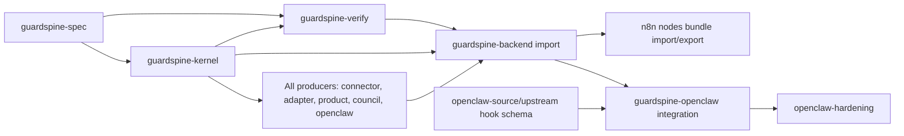
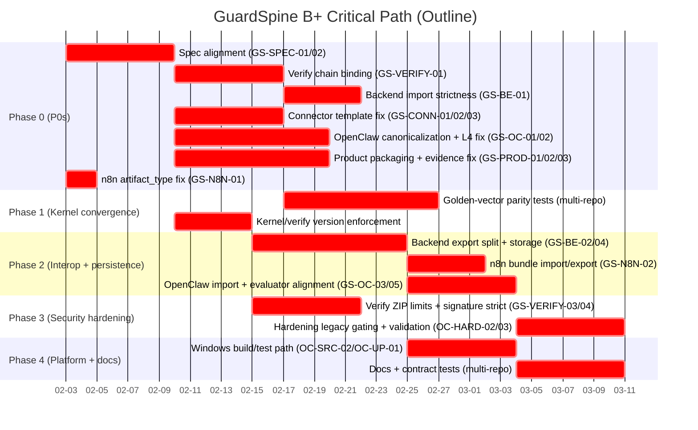

# GuardSpine Ecosystem B+ Plan (Linus-Style)

Date: 2026-02-03
Owner: GuardSpine Program
Scope: All audited repos in GuardSpine-Audit-Latest-2026-02-03

## Goal (B+ Standard)

Achieve a stable, spec-true, auditable evidence pipeline across all repos with:

- Zero known P0/P1 integrity or security gaps.
- Single canonical kernel for hashing/sealing/verify (no custom forks).
- Enforced contract boundaries (version checks, sequence rules, content shape).
- Reproducible tests and golden-vector parity in every producer/consumer.
- Clear docs and deterministic onboarding on Windows + Linux.

---

## Consolidated Issue Backlog (All Findings)

### P0 (Must Fix)

- guardspine-verify: hash chain not bound to items; items can be unchained and still verify. (`guardspine_verify/verifier.py`)
- guardspine-connector-template: emits non-v0.2.0 bundle shape; wrong field names and missing `version`. (`connector/bundle_emitter.py`)
- guardspine-connector-template: non-canonical hash chain/root; fails kernel/verify. (`connector/bundle_emitter.py`)
- guardspine-connector-template: API emission posts to `/bundles` not `/api/v1/bundles/import`. (`connector/bundle_emitter.py`)
- guardspine-connector-template (TS): different schema and non-canonical hashing. (`src/types.ts`, `src/connector.ts`)
- guardspine-openclaw: multiple custom canonicalization/chain implementations (plugin, rlm-docsync, redteam provider). (`plugin.js`, `rlm_docsync.py`, `guardspine_provider.py`)
- guardspine-openclaw: L4 approvals can be self-approved via tool call (no auth gate). (`plugin.js`)
- guardspine-product: packaging broken; declared package does not exist. (`pyproject.toml`)
- guardspine-product: local non-kernel hashing for bundles. (`common/evidence.py`)
- guardspine-product: BaseGuardLane emits non-v0.2.0 bundle format. (`common/base_guard_lane.py`)
- guardspine-product: DocEvidencePack custom schema not wrapped in v0.2.0 bundle. (`common/doc_evidence_pack.py`, `common/docsync_engine.py`)
- n8n-nodes-guardspine: Image/PDF/Sheet nodes send `artifact_kind` but backend requires `artifact_type`. (`GuardSpineImageGuard.node.ts`, `GuardSpinePDFGuard.node.ts`, `GuardSpineSheetGuard.node.ts`)

### P1 (Should Fix)

- guardspine-main: SAML callback unimplemented. (`backend/app/services/auth_service.py`)
- guardspine-backend: kernel logic duplicated without parity tests. (`app/core/kernel.py`)
- guardspine-backend: import verification ignores `item.sequence` and accepts primitive content. (`app/services/imported_bundle_service.py`)
- guardspine-backend: `/bundles/{id}/export` is not spec-compliant but appears to be evidence export. (`app/routers/bundles.py`, `app/services/export_service.py`)
- guardspine-backend: strict signature mode only Ed25519 (rejects valid spec algos). (`app/services/imported_bundle_service.py`)
- guardspine-backend: evidence storage in-memory only (no persistence). (`app/services/bundle_service.py`)
- guardspine-adapter-webhook: `sealBundle()` uses non-spec bundle shape. (`src/bundle-emitter.ts`)
- guardspine-adapter-webhook: `sealBundle()` fails open on kernel missing/error. (`src/bundle-emitter.ts`)
- guardspine-adapter-webhook: kernel types stubbed as `void` return; no contract safety. (`src/guardspine-kernel.d.ts`)
- guardspine-adapter-webhook: EmittedBundle described as ingest-ready but not spec-compliant. (`README.md`)
- guardspine-adapter-webhook: local content hash redundant/misleading. (`src/bundle-emitter.ts`, `src/types.ts`)
- guardspine-adapter-webhook: import metadata does not populate top-level `artifact_id` / `risk_tier`. (`src/importer.ts`)
- guardspine-local-council: local hash/chain without parity tests. (`council.py`)
- guardspine-local-council: bundles not validated against spec (sequence/chain). (`council.py`)
- guardspine-local-council: Ollama provider lacks preflight. (`providers/ollama.py`)
- guardspine-local-council: no signature support or explicit unsigned stance. (`council.py`, `README.md`)
- guardspine-openclaw: evaluator expects fields not produced by rlm-docsync. (`evaluate_evidence.py` vs `rlm_docsync.py`)
- guardspine-openclaw: unknown tool defaults to L2 risk (too permissive). (`plugin.js`)
- guardspine-openclaw: evidence packs written locally, never imported to backend. (`plugin.js`)
- openclaw-hardening: local canonical chain without parity tests. (`hash_chain/chain.py`)
- openclaw-hardening: v0.2.0 validation incomplete (sequence/content_hash). (`hash_chain/chain.py`, `evaluate_evidence.py`, `approval_gate.py`)
- openclaw-hardening: legacy packs accepted without explicit gating. (`approval_gate.py`, `evaluate_evidence.py`)
- openclaw-hardening: health check does not validate Ollama reachability/models. (`health_check.py`)
- openclaw-hardening: promptfoo provider emits non-spec artifacts. (`bundle_src/bundle2/guardspine_provider.py`)
- guardspine-verify: bundle version not enforced. (`verifier.py`)
- guardspine-verify: ZIP ingestion has no safety limits. (`verifier.py`)
- guardspine-verify: unsigned bundles can pass with public key supplied. (`verifier.py`, `cli.py`)
- guardspine-verify: HMAC base64-hex documented but unsupported. (`verifier.py`)
- guardspine-spec: README chain rule contradicts schema (content_hash vs chain_hash). (`README.md`)
- guardspine-spec: examples not v0.2.0 compliant. (`examples/*.json`)
- guardspine-spec: README bundle structure diverges from schema. (`README.md`)
- n8n-nodes-guardspine: no bundle import/export; hashes opaque. (`GuardGate.node.ts`, `CodeGuard.node.ts`, `EvidenceSeal.node.ts`, `CouncilVote.node.ts`)
- n8n-nodes-guardspine: ApprovalWait fallback URL points at GuardSpine, not n8n. (`ApprovalWait.node.ts`)
- n8n-nodes-guardspine: CouncilVote is demo-only and silent in prod. (`CouncilVote.node.ts`)
- openclaw-source: tests OOM on Windows; no low-memory profile. (`scripts/test-parallel.mjs`, `vitest.config.ts`)
- openclaw-source: build/test relies on bash; Windows unsupported. (`scripts/bundle-a2ui.sh`, `package.json`)
- openclaw-source: unversioned hook events (no schema contract). (`src/hooks/types.ts`)
- openclaw-upstream: Windows support partial; build/test relies on bash. (`package.json`, `scripts/bundle-a2ui.sh`, `src/commands/onboard.ts`)
- openclaw-upstream: onboarding test skipped on Windows due to config write issues. (`onboard-non-interactive.gateway.test.ts`)
- openclaw-upstream: unversioned hook events (no schema contract). (`src/hooks/types.ts`)

### P2 (Cleanup / Consistency)

- guardspine-backend: `_build_spec_bundle` emits `created_at: null` (violates schema). (`bundle_service.py`)
- guardspine-backend: evidence seal response references wrong CLI (`guardspine` vs `guardspine-verify`). (`routers/evidence.py`)
- guardspine-backend: export verification instructions inaccurate. (`services/export_service.py`)
- guardspine-adapter-webhook: README unclear about pre-seal bundle shape. (`README.md`)
- guardspine-adapter-webhook: local content hashes redundant. (`bundle-emitter.ts`, `types.ts`)
- guardspine-adapter-webhook: top-level fields missing in import bundle. (`importer.ts`)
- guardspine-local-council: tests do not verify bundle validity. (`tests/test_council.py`)
- guardspine-local-council: README omits bundle output contract. (`README.md`)
- guardspine-kernel: verify does not enforce version. (`src/verify.ts`)
- guardspine-kernel: proof version semantics implicit. (`src/seal.ts`, `src/verify.ts`)
- guardspine-kernel: unsupported signature algos not explicit in errors. (`src/verify.ts`)
- guardspine-spec: duplicate schema files with same `$id`. (`schemas/*`)
- guardspine-spec: validate-schemas script not portable, no real validation. (`validate-schemas.mjs`)
- guardspine-verify: README claims features not implemented. (`README.md`)
- guardspine-verify: legacy chain support inconsistent. (`verifier.py`)
- guardspine-verify: version label mismatched (`__version__` 0.1.0). (`__init__.py`)
- guardspine-verify: CLI exit codes inconsistent with docs. (`cli.py`)
- n8n-nodes-guardspine: README incomplete/out of date. (`README.md`)
- n8n-nodes-guardspine: tests are structural only; no contract payload validation. (`__tests__/nodes.test.ts`)
- openclaw-hardening: evidence schema duplication and lack of validation against examples. (`schemas/evidence_pack.json`, `tests/test_schemas.py`)
- openclaw-hardening: mixed terminology (`schema_version` vs `version`). (`rlm_docsync.py`, `docs/ARCHITECTURE.md`)
- openclaw-hardening: approval channel stubs are easy to misuse. (`discord_stub.py`, `sms_stub.py`)
- openclaw-source: large surfaces excluded from unit coverage. (`vitest.config.ts`)
- openclaw-source: dependency overrides drift from upstream. (`package.json`)
- openclaw-upstream: Windows CI ignores unhandled errors; coverage gaps. (`scripts/test-parallel.mjs`, `vitest.config.ts`)

---

## Cascading Fix Strategy (Stop-the-bleed first)

### A. Contract Truth and Canonicalization (root cause for most drift)

1. guardspine-spec: fix README chain rule, update v0.2.0 examples, align bundle structure.
2. guardspine-kernel: enforce `version == 0.2.0` in verify; add explicit proof version field or metadata.
3. guardspine-verify: enforce version allowlist and chain-to-items binding; add strict signature mode.
4. guardspine-backend: enforce import sequence/content rules and upgrade export endpoints to avoid spec confusion.
5. Remove/replace local canonicalization in all producer repos and route sealing through kernel.

### B. Evidence Integrity Security Gates

1. guardspine-openclaw: remove self-approve tool path for L4 or require authenticated token.
2. guardspine-verify: zip safety limits and stricter signature handling.
3. openclaw-hardening: explicit legacy gating and strict sequence/content_hash enforcement.
4. backend: durable storage or explicitly deny non-demo usage.

### C. Interop Plumbing

1. Standardize on `/api/v1/bundles/import` for all emitters (connector template, adapter, openclaw).
2. Add bundle import/export nodes for n8n.
3. Reconcile evaluator schema with emitted packs (openclaw integration + hardening).

### D. Reliability & Platform

1. Add Windows-safe build path or explicit WSL-only gating in openclaw source/upstream.
2. Add low-memory test profile to avoid OOM.
3. Fix packaging and install paths (guardspine-product).

---

## B+ Delivery Plan (Phased)

### Phase 0 (Immediate, 0-7 days): Integrity P0s + Blocking P1s

- Fix guardspine-verify chain-to-items binding (P0).
- Fix connector-template to emit v0.2.0 bundle shape, canonical chain, and correct import endpoint (P0).
- Fix guardspine-openclaw canonicalization: remove custom chain logic and force kernel sealing (P0).
- Fix guardspine-openclaw L4 self-approval (P0).
- Fix guardspine-product packaging (P0).
- Fix guardspine-product evidence emissions to v0.2.0 or relabel as non-evidence (P0).
- Fix n8n `artifact_type` request field (P0).
- Add temporary hard gate: deny import of non-v0.2.0 bundles in backend or verify (fails fast).
  Deliverables: zero P0s open; failing tests added to lock the fixes.

### Phase 1 (Week 2-3): Canonical Kernel Convergence

- Add golden vector parity tests in backend, local council, openclaw-hardening, adapter-webhook.
- Remove or deprecate all custom canonicalization; call kernel for sealing/verify.
- Define a Python bridge for kernel or enforce a JS-only sealing pipeline.
- Enforce import sequence/content shape in backend; enforce version in kernel/verify.
- Upgrade spec README/examples; add schema validation to CI.
  Deliverables: all producers/consumers pass golden-vector parity; spec docs match schema.

### Phase 2 (Week 3-4): Interop and Persistence

- Split backend export into spec export vs report export, rename endpoints and docs.
- Add durable storage for bundles; disable non-demo mode without persistence.
- Wire openclaw integration and n8n nodes to `/api/v1/bundles/import`.
- Align evaluator schema with produced evidence packs; add round-trip tests.
  Deliverables: evidence produced in every repo can be imported, verified, exported, and re-verified.

### Phase 3 (Week 4-5): Security Hardening

- guardspine-verify ZIP limits; strict signature mode.
- openclaw-hardening legacy gating default deny.
- local council: optional signing hook or explicit unsigned stance.
- openclaw approvals: require explicit approval channels; disable stubs by default.
  Deliverables: security posture documented and enforced with tests.

### Phase 4 (Week 5-6): Reliability, Platform, Docs

- Windows-safe build/test path or WSL-only gating in openclaw source/upstream.
- Low-memory test profile; stabilize CI runs.
- Update READMEs and repo maps; remove or label legacy docs/examples.
- Add contract tests to n8n nodes to prevent request drift.
  Deliverables: predictable CI, accurate docs, stable onboarding.

---

## Cascading Dependencies (Critical Path)

1. Spec and kernel rules ? verifier enforcement ? backend import strictness.
2. Kernel sealing ? all producers (adapter, connector template, product, council, openclaw).
3. Backend import/export semantics ? n8n nodes, openclaw integration.
4. Evidence schema alignment ? evaluator reliability (openclaw + hardening).
5. Platform stability ? CI coverage confidence for future changes.

---

## Definition of Done (B+)

- No open P0/P1 findings across all audited repos.
- All evidence producers use canonical kernel sealing or a vetted bridge.
- guardspine-verify strictly enforces version and chain-to-items binding.
- Backend import rejects spec-invalid bundles; export endpoints are clearly separated.
- Spec README/examples match schema; schema validation in CI.
- Windows build/test either supported or explicitly gated; low-memory profile documented.
- Each repo has at least one golden-vector parity test and one end-to-end verify test.

---

## Suggested Tracking Artifacts

- Single cross-repo issue tracker with labels: `P0`, `P1`, `Interop`, `Canonicalization`, `Docs`, `Windows`.
- A shared fixture pack of golden vectors (immutable) and a CI job that verifies parity across repos.
- A monthly contract review (spec + kernel + verify) to prevent drift.

## Next Requests (Appended)

1. Break this plan into per-repo actionable tickets with owners and estimates.
2. Generate a dependency graph and critical path Gantt outline.

## Per-Repo Actionable Tickets (Owners + Estimates)

Note: Owners are placeholders by role. Replace "TBD" with named leads.
Estimates are dev-days (DD).

### guardspine-spec

- GS-SPEC-01 [P1] Align README chain rule + bundle structure with schema. Owner: TBD (Spec/Docs). Est: 2 DD. Depends: none.
- GS-SPEC-02 [P1] Update examples to v0.2.0 compliant bundles. Owner: TBD (Spec/Docs). Est: 1 DD. Depends: GS-SPEC-01.
- GS-SPEC-03 [P2] Replace validate-schemas script with Ajv + CI validation. Owner: TBD (Spec/DevEx). Est: 2 DD. Depends: GS-SPEC-01.
- GS-SPEC-04 [P2] Remove duplicate schema or add sync check. Owner: TBD (Spec/DevEx). Est: 1 DD. Depends: none.

### guardspine-kernel

- GS-KERN-01 [P2] Enforce bundle version in verify (v0.2.0). Owner: TBD (Kernel). Est: 1 DD. Depends: GS-SPEC-01.
- GS-KERN-02 [P2] Record proof version or expose in metadata. Owner: TBD (Kernel). Est: 1-2 DD. Depends: GS-KERN-01.
- GS-KERN-03 [P2] Explicit error for unsupported signature algorithms. Owner: TBD (Kernel). Est: 1 DD. Depends: none.

### guardspine-verify

- GS-VERIFY-01 [P0] Bind chain entries to items (count, item_id, content_hash, order). Owner: TBD (Verify). Est: 2-3 DD. Depends: GS-SPEC-01.
- GS-VERIFY-02 [P1] Enforce version allowlist; add legacy flag. Owner: TBD (Verify). Est: 1-2 DD. Depends: GS-SPEC-01.
- GS-VERIFY-03 [P1] Add ZIP safety limits (size, count, traversal). Owner: TBD (Verify/Sec). Est: 1-2 DD. Depends: none.
- GS-VERIFY-04 [P1] Add require-signatures mode when public key supplied. Owner: TBD (Verify). Est: 1-2 DD. Depends: none.
- GS-VERIFY-05 [P1] HMAC base64-hex support or doc correction. Owner: TBD (Verify). Est: 1 DD. Depends: none.
- GS-VERIFY-06 [P2] README/API alignment + version bump + exit codes. Owner: TBD (Verify/Docs). Est: 1-2 DD. Depends: GS-VERIFY-01.

### guardspine-backend / guardspine-main

- GS-BE-01 [P1] Enforce item.sequence and content shape on import. Owner: TBD (Backend). Est: 1-2 DD. Depends: GS-SPEC-01.
- GS-BE-02 [P1] Split report export vs spec bundle export. Owner: TBD (Backend). Est: 2-3 DD. Depends: GS-SPEC-01.
- GS-BE-03 [P1] Expand strict signature mode to all spec algorithms or document a restricted profile. Owner: TBD (Backend). Est: 1-2 DD. Depends: GS-SPEC-01.
- GS-BE-04 [P1] Add durable storage or disable non-demo without persistence. Owner: TBD (Backend/Infra). Est: 3-5 DD. Depends: infra decision.
- GS-BE-05 [P2] Fix created_at null + CLI string + export instructions. Owner: TBD (Backend). Est: 1-2 DD. Depends: none.
- GS-AUTH-01 [P1] Implement SAML callback handling. Owner: TBD (Backend/Auth). Est: 2-4 DD. Depends: IdP config.

### guardspine-adapter-webhook

- GS-ADAPT-01 [P1] Remove/refactor sealBundle to only seal spec bundles. Owner: TBD (Adapter). Est: 1-2 DD. Depends: GS-KERN-01.
- GS-ADAPT-02 [P1] Fail closed when kernel missing/error. Owner: TBD (Adapter). Est: 1 DD. Depends: none.
- GS-ADAPT-03 [P1] Replace stub kernel types with correct types. Owner: TBD (Adapter). Est: 1 DD. Depends: kernel typings.
- GS-ADAPT-04 [P2] README clarify + remove redundant hashes + add top-level fields. Owner: TBD (Adapter/Docs). Est: 1-2 DD. Depends: GS-ADAPT-01.

### guardspine-connector-template

- GS-CONN-01 [P0] Emit v0.2.0 bundle shape with version and correct fields. Owner: TBD (Connector). Est: 2-3 DD. Depends: GS-SPEC-01.
- GS-CONN-02 [P0] Remove local canonicalization; use kernel sealing. Owner: TBD (Connector). Est: 2-3 DD. Depends: kernel bridge decision.
- GS-CONN-03 [P0] Use /api/v1/bundles/import for emission. Owner: TBD (Connector). Est: 0.5 DD. Depends: none.
- GS-CONN-04 [P1] Add golden-vector parity tests. Owner: TBD (Connector). Est: 2-3 DD. Depends: GS-CONN-01/02.
- GS-CONN-05 [P1] Fix packaging/CLI entrypoint if used. Owner: TBD (Connector). Est: 1 DD. Depends: none.

### guardspine-product

- GS-PROD-01 [P0] Fix packaging layout in pyproject. Owner: TBD (SDK/Product). Est: 1-2 DD. Depends: none.
- GS-PROD-02 [P0] Replace local evidence hashing with kernel sealing or relabel as non-evidence. Owner: TBD (SDK/Product). Est: 2-3 DD. Depends: kernel bridge decision.
- GS-PROD-03 [P0] Convert BaseGuardLane/DocEvidencePack to v0.2.0 bundles or clearly mark legacy. Owner: TBD (SDK/Product). Est: 3-5 DD. Depends: GS-PROD-02.
- GS-PROD-04 [P1] Fix tests and add contract fixtures. Owner: TBD (SDK/Product). Est: 2-3 DD. Depends: GS-PROD-02.

### guardspine-local-council

- GS-COUNCIL-01 [P1] Add kernel parity tests for hash/chain. Owner: TBD (Council). Est: 2 DD. Depends: fixture availability.
- GS-COUNCIL-02 [P1] Validate bundles (sequence + chain) before return. Owner: TBD (Council). Est: 1-2 DD. Depends: GS-COUNCIL-01.
- GS-COUNCIL-03 [P1] Ollama preflight for model reachability. Owner: TBD (Council). Est: 1 DD. Depends: none.
- GS-COUNCIL-04 [P1] Add signing hook or explicit unsigned policy. Owner: TBD (Council). Est: 1-2 DD. Depends: none.
- GS-COUNCIL-05 [P2] Add verify test + README output contract. Owner: TBD (Council). Est: 1-2 DD. Depends: GS-COUNCIL-02.

### guardspine-openclaw (integration)

- GS-OC-01 [P0] Replace all custom canonicalization with kernel sealing. Owner: TBD (OpenClaw Integration). Est: 4-6 DD. Depends: kernel bridge decision.
- GS-OC-02 [P0] Remove L4 self-approval tool or require auth token. Owner: TBD (OpenClaw Integration/Sec). Est: 1-2 DD. Depends: none.
- GS-OC-03 [P1] Align evaluator schema with emitted packs + add round-trip tests. Owner: TBD (OpenClaw Integration). Est: 2-3 DD. Depends: GS-OC-01.
- GS-OC-04 [P1] Unknown tools default to L3/L4 or deny. Owner: TBD (OpenClaw Integration/Sec). Est: 1 DD. Depends: none.
- GS-OC-05 [P1] Import evidence packs into backend (/api/v1/bundles/import). Owner: TBD (OpenClaw Integration). Est: 2-3 DD. Depends: GS-BE-01.

### openclaw-hardening

- OC-HARD-01 [P1] Add kernel parity tests for hash_chain. Owner: TBD (Hardening). Est: 2 DD. Depends: fixture availability.
- OC-HARD-02 [P1] Enforce v0.2.0 sequence/content_hash in evaluation + approvals. Owner: TBD (Hardening). Est: 2-3 DD. Depends: GS-SPEC-01.
- OC-HARD-03 [P1] Gate legacy packs behind config (default deny). Owner: TBD (Hardening/Sec). Est: 1 DD. Depends: none.
- OC-HARD-04 [P1] Ollama health preflight. Owner: TBD (Hardening). Est: 1 DD. Depends: none.
- OC-HARD-05 [P1] Replace promptfoo artifacts with v0.2.0 or label non-evidence. Owner: TBD (Hardening). Est: 2-3 DD. Depends: GS-SPEC-01.

### n8n-nodes-guardspine

- GS-N8N-01 [P0] Fix artifact_type field in guard nodes. Owner: TBD (n8n Integrations). Est: 0.5 DD. Depends: none.
- GS-N8N-02 [P1] Add bundle import/export node or option. Owner: TBD (n8n Integrations). Est: 2-3 DD. Depends: GS-BE-02.
- GS-N8N-03 [P1] Fix ApprovalWait webhook URL handling. Owner: TBD (n8n Integrations). Est: 1 DD. Depends: none.
- GS-N8N-04 [P1] CouncilVote demo-only error handling. Owner: TBD (n8n Integrations). Est: 0.5 DD. Depends: none.
- GS-N8N-05 [P2] README + contract tests. Owner: TBD (n8n Integrations). Est: 1-2 DD. Depends: GS-N8N-01.

### openclaw-source

- OC-SRC-01 [P1] Low-memory test profile. Owner: TBD (OpenClaw Platform). Est: 1 DD. Depends: none.
- OC-SRC-02 [P1] Windows-safe build path or WSL-only gating. Owner: TBD (OpenClaw Platform). Est: 2-3 DD. Depends: none.
- OC-SRC-03 [P1] Version hook event payloads or publish schema. Owner: TBD (OpenClaw Platform). Est: 2-3 DD. Depends: none.

### openclaw-upstream

- OC-UP-01 [P1] Windows-safe build path or WSL-only gating. Owner: TBD (OpenClaw Platform). Est: 2-3 DD. Depends: none.
- OC-UP-02 [P1] Fix Windows onboarding test and remove skip. Owner: TBD (OpenClaw Platform). Est: 2-3 DD. Depends: OC-UP-01.
- OC-UP-03 [P1] Version hook event payloads or publish schema. Owner: TBD (OpenClaw Platform). Est: 2-3 DD. Depends: none.

---

## Dependency Graph (Mermaid)

## Critical Path Gantt Outline (Mermaid)

## Validation-Based Corrections (2026-02-03)

See `C:\Users\17175\Desktop\GuardSpine-Audit-Validation-2026-02-03.md` for evidence and verification notes.
This addendum supersedes the earlier Consolidated Issue Backlog and ticket list.

## Corrected Consolidated Issue Backlog (Supersedes earlier list)

### P0 (Must Fix)

- guardspine-verify: hash chain not bound to items; items can be unchained and still verify. (`guardspine_verify/verifier.py`)
- guardspine-connector-template: emits non-v0.2.0 bundle shape (wrong fields, missing `version`). (`connector/bundle_emitter.py`)
- guardspine-connector-template: non-canonical hash chain/root (fails kernel/verify). (`connector/bundle_emitter.py`)
- guardspine-connector-template: API emission posts to `/bundles` not `/api/v1/bundles/import`. (`connector/bundle_emitter.py`)
- guardspine-connector-template (TS): different schema and non-canonical hashing. (`src/types.ts`, `src/connector.ts`)
- guardspine-openclaw: multiple custom canonicalization/chain implementations (plugin, rlm-docsync, redteam provider). (`plugin.js`, `rlm_docsync.py`, `guardspine_provider.py`)
- guardspine-openclaw: L4 approvals can be self-approved via tool call (no auth gate). (`plugin.js`)
- guardspine-product: packaging broken; declared package does not exist. (`pyproject.toml`)
- guardspine-product: local non-kernel hashing for bundles. (`common/evidence.py`)
- guardspine-product: BaseGuardLane emits non-v0.2.0 bundle format. (`common/base_guard_lane.py`)
- guardspine-product: DocEvidencePack custom schema not wrapped in v0.2.0 bundle. (`common/doc_evidence_pack.py`, `common/docsync_engine.py`)
- n8n-nodes-guardspine: Image/PDF/Sheet nodes send `artifact_kind` but backend requires `artifact_type`. (`GuardSpineImageGuard.node.ts`, `GuardSpinePDFGuard.node.ts`, `GuardSpineSheetGuard.node.ts`)

### P1 (Should Fix)

- guardspine-backend: kernel logic duplicated without parity tests. (`app/core/kernel.py`)
- guardspine-backend: import verification ignores `item.sequence` and accepts primitive content. (`app/services/imported_bundle_service.py`)
- guardspine-backend: `/bundles/{id}/export` is not spec-compliant but appears to be evidence export. (`app/routers/bundles.py`, `app/services/export_service.py`)
- guardspine-backend: strict signature mode only Ed25519 (rejects valid spec algos). (`app/services/imported_bundle_service.py`)
- guardspine-backend: evidence storage in-memory only (no persistence). (`app/services/bundle_service.py`)
- guardspine-adapter-webhook: `sealBundle()` uses non-spec bundle shape. (`src/bundle-emitter.ts`)
- guardspine-adapter-webhook: `sealBundle()` fails open on kernel missing/error. (`src/bundle-emitter.ts`)
- guardspine-adapter-webhook: kernel types stubbed as `void` return; no contract safety. (`src/guardspine-kernel.d.ts`)
- guardspine-local-council: local hash/chain without parity tests. (`council.py`)
- guardspine-local-council: bundles not validated against spec (sequence/chain). (`council.py`)
- guardspine-local-council: Ollama provider lacks preflight. (`providers/ollama.py`)
- guardspine-local-council: no signature support or explicit unsigned stance. (`council.py`, `README.md`)
- guardspine-openclaw: evaluator expects fields not produced by rlm-docsync. (`evaluate_evidence.py` vs `rlm_docsync.py`)
- guardspine-openclaw: unknown tool defaults to L2 risk (too permissive). (`plugin.js`)
- guardspine-openclaw: evidence packs written locally, never imported to backend. (`plugin.js`)
- openclaw-hardening: canonical chain duplicated without parity tests. (`hash_chain/chain.py`)
- openclaw-hardening: v0.2.0 validation incomplete (sequence not enforced; content_hash only validated when items are provided). (`hash_chain/chain.py`, `evaluate_evidence.py`, `approval_gate.py`)
- openclaw-hardening: legacy packs accepted without explicit gating. (`approval_gate.py`, `evaluate_evidence.py`)
- openclaw-hardening: health check does not validate Ollama reachability/models. (`health_check.py`)
- openclaw-hardening: promptfoo provider emits non-spec artifacts. (`bundle_src/bundle2/guardspine_provider.py`)
- guardspine-verify: bundle version not enforced. (`verifier.py`)
- guardspine-verify: ZIP ingestion has no safety limits. (`verifier.py`)
- guardspine-verify: unsigned bundles can still be ?verified? when a public key is provided. (`verifier.py`, `cli.py`)
- guardspine-verify: HMAC base64-hex is implied in code comments but unsupported in logic. (`verifier.py`)
- guardspine-spec: README chain rule contradicts schema (content_hash vs chain_hash). (`README.md`)
- guardspine-spec: examples not v0.2.0 compliant. (`examples/*.json`)
- guardspine-spec: README bundle structure diverges from schema. (`README.md`)
- n8n-nodes-guardspine: no bundle import/export; hashes opaque. (`GuardGate.node.ts`, `CodeGuard.node.ts`, `EvidenceSeal.node.ts`, `CouncilVote.node.ts`)
- n8n-nodes-guardspine: ApprovalWait fallback URL points at GuardSpine, not n8n. (`ApprovalWait.node.ts`)
- n8n-nodes-guardspine: CouncilVote is demo-only and silent in prod. (`CouncilVote.node.ts`)
- guardspine-connector-template: README claims v0.2.0 compatibility but templates are not aligned. (`README.md`)
- guardspine-connector-template: Python and TypeScript templates are mutually incompatible. (`connector/bundle_emitter.py`, `src/types.ts`)
- guardspine-connector-template: pyproject versioning contradicts README (spec v1.0.0 vs v0.2.0). (`pyproject.toml`, `README.md`)
- guardspine-connector-template: CLI entrypoint declared but missing. (`pyproject.toml`, missing `connector/cli.py`)
- guardspine-product: tests reference missing enums/constructors (tests fail). (`tests/test_common_imports.py`)
- guardspine-product: docs claim files/modules that do not exist. (`REPO-STRUCTURE.md`)
- guardspine-product: absolute imports break installed package usage. (`common/docsync_engine.py`, `common/rlm_inspection.py`)
- openclaw-source: no low-memory test guardrail; OOM reports are environmental but risk remains. (`scripts/test-parallel.mjs`, `vitest.config.ts`)
- openclaw-source: build/test relies on bash; Windows unsupported without WSL. (`package.json`, `scripts/*.sh`)
- openclaw-source: hook events unversioned (no schema contract). (`src/hooks/types.ts`)
- openclaw-upstream: build/test relies on bash; Windows unsupported without WSL. (`package.json`, `scripts/*.sh`)
- openclaw-upstream: onboarding test skipped on Windows due to config write issues. (`onboard-non-interactive.gateway.test.ts`)
- openclaw-upstream: hook events unversioned (no schema contract). (`src/hooks/types.ts`)

### P2 (Cleanup / Consistency)

- guardspine-backend: `_build_spec_bundle` emits `created_at: null` (schema violation). (`bundle_service.py`)
- guardspine-backend: evidence seal response references wrong CLI (`guardspine` vs `guardspine-verify`). (`routers/evidence.py`)
- guardspine-backend: export verification instructions inaccurate. (`services/export_service.py`)
- guardspine-adapter-webhook: README unclear about EmittedBundle (pre-seal vs spec). (`README.md`)
- guardspine-adapter-webhook: local content hashes are redundant/misleading. (`bundle-emitter.ts`, `types.ts`)
- guardspine-adapter-webhook: import metadata omits top-level `artifact_id` / `risk_tier`. (`importer.ts`)
- guardspine-local-council: tests do not verify bundle validity. (`tests/test_council.py`)
- guardspine-local-council: README omits bundle output contract. (`README.md`)
- guardspine-kernel: verify does not enforce bundle version (value). (`src/verify.ts`)
- guardspine-kernel: proof version semantics are implicit (not recorded). (`src/seal.ts`, `src/verify.ts`)
- guardspine-kernel: unsupported signature algos are not reported explicitly. (`src/verify.ts`)
- guardspine-spec: duplicate schema files with same `$id`. (`schemas/*`)
- guardspine-spec: validate-schemas script not portable and lacks real validation. (`validate-schemas.mjs`)
- guardspine-verify: README claims features not implemented. (`README.md`)
- guardspine-verify: legacy chain support inconsistent. (`verifier.py`)
- guardspine-verify: version label mismatched (`__version__` 0.1.0). (`__init__.py`)
- guardspine-verify: CLI exit codes inconsistent with docs. (`cli.py`)
- n8n-nodes-guardspine: README incomplete/out of date. (`README.md`)
- n8n-nodes-guardspine: tests are structural only (no contract payload validation). (`__tests__/nodes.test.ts`)
- openclaw-hardening: evidence schema duplication and no validation vs examples. (`schemas/evidence_pack.json`, `tests/test_schemas.py`)
- openclaw-hardening: mixed terminology (`schema_version` vs `version`). (`rlm_docsync.py`, `docs/ARCHITECTURE.md`)
- openclaw-hardening: approval channel stubs are easy to misuse. (`discord_stub.py`, `sms_stub.py`)
- guardspine-openclaw: `guardspine_root` config defined but unused. (`openclaw.plugin.json`, `plugin.js`)
- guardspine-openclaw: `created_at` fields are not hashed (mutable metadata). (`plugin.js`)
- guardspine-product: no contract/golden-vector tests. (tests/)
- guardspine-product: adapter hashes not prefixed with `sha256:` or documented. (`adapters/*`)
- guardspine-product: README/REPO-STRUCTURE imply monorepo layout that packaging doesn?t match. (`README.md`, `REPO-STRUCTURE.md`, `pyproject.toml`)
- guardspine-connector-template: no tests or golden vectors. (`pyproject.toml`, `rg "test_"`)
- guardspine-connector-template: `format: zip` advertised but not implemented. (`config.example.yaml`, `bundle_emitter.py`)
- guardspine-connector-template: hashing uses `json.dumps` (non-canonical JSON). (`bundle_emitter.py`)
- openclaw-source: large surfaces excluded from unit coverage. (`vitest.config.ts`)
- openclaw-source: dependency overrides drift from upstream. (`package.json`)
- openclaw-upstream: Windows CI ignores unhandled errors; coverage gaps. (`scripts/test-parallel.mjs`, `vitest.config.ts`)

## Ticket Addendum (Supersedes/Updates earlier ticket list)

- Remove: GS-AUTH-01 (SAML callback unimplemented) ? outdated.
- Add (connector-template):
  - GS-CONN-06 [P1] Fix README/spec claims and align versioning language. Est: 1 DD.
  - GS-CONN-07 [P1] Unify Python/TS template schema or remove one to avoid fork. Est: 2-3 DD.
  - GS-CONN-08 [P1] Resolve pyproject/README version contradiction. Est: 1 DD.
  - GS-CONN-09 [P2] Add tests + golden vectors, implement zip format switch, replace json.dumps hashing with canonical JSON. Est: 3-5 DD.
- Add (guardspine-product):
  - GS-PROD-05 [P1] Fix broken tests (EvidenceType.LOG_DATA) and constructor mismatches. Est: 1-2 DD.
  - GS-PROD-06 [P1] Update docs + repo map; align to actual module layout. Est: 1-2 DD.
  - GS-PROD-07 [P1] Fix absolute imports for installed package usage. Est: 1-2 DD.
  - GS-PROD-08 [P2] Add contract/golden tests; normalize hash prefixes in adapters. Est: 2-3 DD.
- Add (guardspine-openclaw):
  - GS-OC-06 [P2] Remove or implement `guardspine_root` config. Est: 0.5-1 DD.
  - GS-OC-07 [P2] Include `created_at` in hashed content or move to metadata and document immutability scope. Est: 1-2 DD.
- Update (openclaw-hardening):
  - OC-HARD-02 [P1] Enforce `sequence == index`; content_hash already validated when items present. Est: 2-3 DD.
- Update (openclaw-source):
  - OC-SRC-01 [P1] Add low-memory test guardrail (OOM reports unverified). Est: 1 DD.
